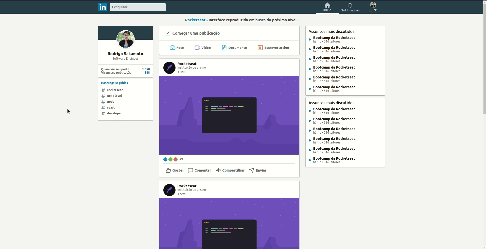

<h1 align="center">
	LinkedIn Clone
</h1>

<h3 align="center">Linkedin clone - aplicação desenvolvida para estudar o shimmer effect</h3>

<p align="center">
  
</p>
<p align="center"> 
  <a href="linkedinshimmer.netlify.app">Deploy here</a>
</p>

## 🛠 Tecnologias

As seguintes ferramentas foram usadas na construção do projeto:

- [React](https://pt-br.reactjs.org/)
- [styled-components](https://styled-components.com/)
- [react-icons](https://react-icons.github.io/react-icons/)


## Pré-requisitos

Antes de começar, você vai precisar ter instalado em sua máquina as seguintes ferramentas:
[Git](https://git-scm.com), [Node.js](https://nodejs.org/en/), [Yarn](https://classic.yarnpkg.com/lang/en/). 
Além disto é bom ter um editor para trabalhar com o código como [VSCode](https://code.visualstudio.com/)

## 💾 Instalação

```bash
# Clone este repositório
$ git clone https://github.com/rodrigosakamoto/shimmer-effect.git

# Acesse a pasta do projeto no terminal/cmd
$ cd shimmer-effect

# Instale as dependências
$ yarn

# Execute a aplicação
$ yarn start
```

---
By Rodrigo Sakamoto

[](https://www.linkedin.com/in/rodrigo-sakamoto/) 
[](mailto:rodosakamoto@gmail.com)